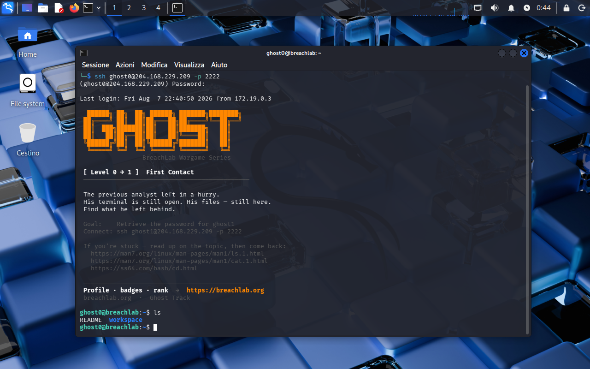
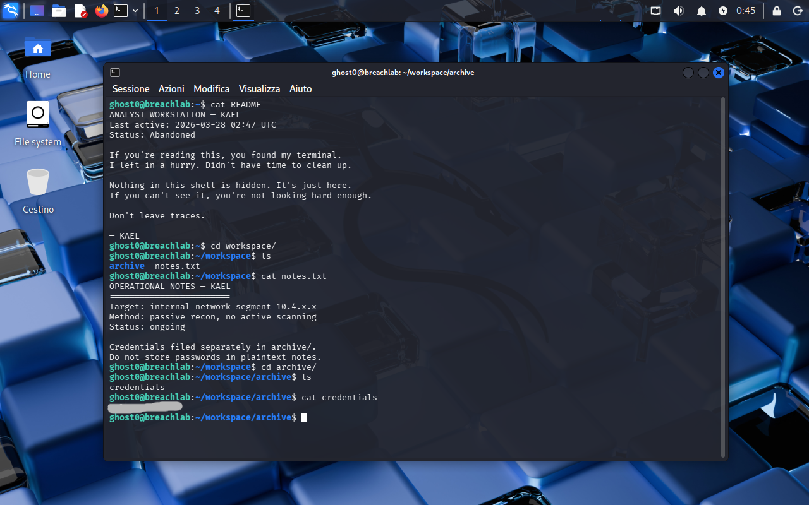

<!-- portfolio-desc: KAEL's abandoned terminal, and the notes that point straight to the flag -->

# Ghost Level 0 - First Contact

## Objective

> The previous analyst, KAEL, left the terminal open and walked away mid-session. Nothing on the box is hidden. The goal: find what KAEL left behind and pull the password for `ghost1`.

---

## Access

| Field | Value |
|---|---|
| Method | `ssh` |
| Host | `204.168.229.209:2222` |
| User | `ghost0` |
| Password | `ghost0` (the track's published starting credential) |

```bash
ssh ghost0@204.168.229.209 -p 2222
```

---

## Tools / concepts

- `ls`: see what's actually there before guessing
- `cat`: read a file straight to stdout
- `cd`: move into the directory that matters

---

## Solution

### Step 1: Log in and look around

The login banner states the goal outright: retrieve the password for `ghost1`. A first `ls` in the home directory turns up two entries, `README` and `workspace`. Nothing about the names screams "start here", so the README gets read first.



### Step 2: Read KAEL's trail instead of guessing

`cat README` turns out to be a note from KAEL, the analyst who used to sit at this terminal:

```
ANALYST WORKSTATION — KAEL
Last active: 2026-03-28 02:47 UTC
Status: Abandoned

If you're reading this, you found my terminal.
I left in a hurry. Didn't have time to clean up.

Nothing in this shell is hidden. It's just here.
If you can't see it, you're not looking hard enough.

Don't leave traces.

— KAEL
```

That note is the actual recon step, not flavor text. It says nothing is hidden, so the right move is reading, not brute-forcing paths. `cd workspace/` and `ls` show `archive` and `notes.txt`, and `notes.txt` is next:

```
OPERATIONAL NOTES — KAEL

Target: internal network segment 10.4.x.x
Method: passive recon, no active scanning
Status: ongoing

Credentials filed separately in archive/.
Do not store passwords in plaintext notes.
```

KAEL spells out exactly where to look next: `archive/`. `cd archive/`, `ls` shows one file, `credentials`, and `cat credentials` prints the password for `ghost1`.



### Step 3: Flag found

The password sits in `~/workspace/archive/credentials`, in plaintext, exactly where KAEL's own notes pointed.

---

## Notes

KAEL's notes.txt says "do not store passwords in plaintext notes" one line before pointing straight at a plaintext credentials file. That's the level's joke, but it's also the pattern worth carrying forward into later levels: the "abandoned analyst" material scattered across these boxes (READMEs, notes, memos) isn't set dressing, it's the actual map. Reading everything in full before reaching for anything beyond `ls`/`cat` beats guessing paths every time.
