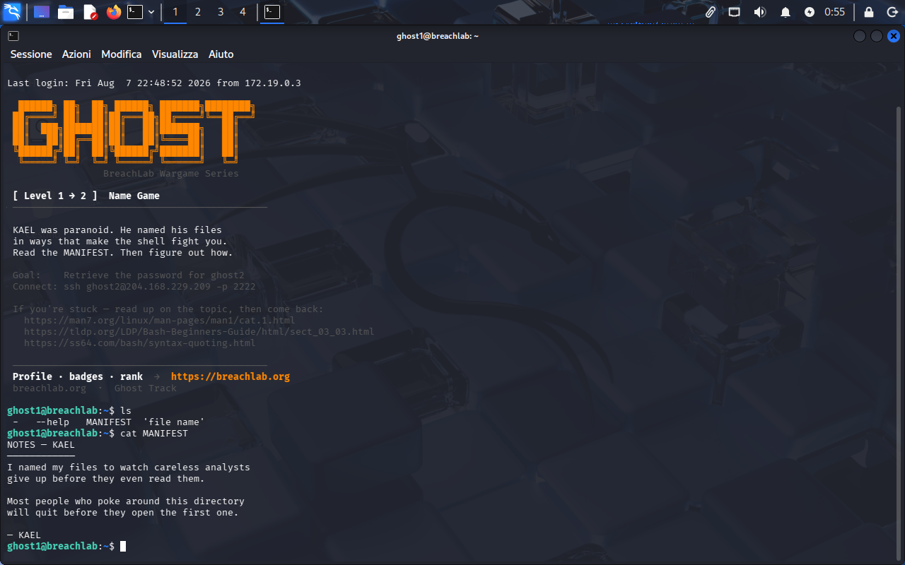
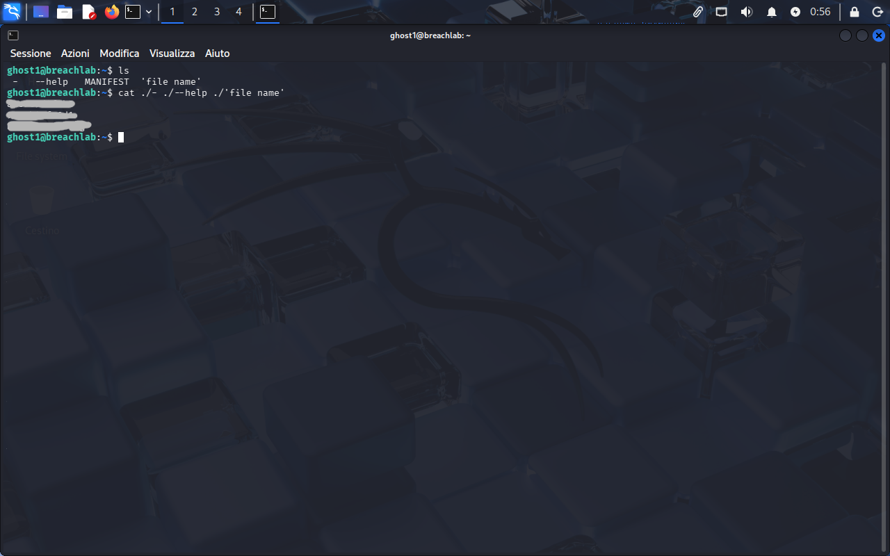

<!-- portfolio-desc: KAEL's adversarial filenames, and the quoting trick that reads them anyway -->

# Ghost Level 1 - Name Game

## Objective

> KAEL named his files to make the shell fight back. The MANIFEST explains why. The goal: work out how to read the rest, and pull the password for `ghost2`.

---

## Access

| Field | Value |
|---|---|
| Method | `ssh` |
| Host | `204.168.229.209:2222` |
| User | `ghost1` |
| Password | `[REDACTED]` (found in Level 0) |

```bash
ssh ghost1@204.168.229.209 -p 2222
```

---

## Tools / concepts

- `./` prefix: forces a name to be read as a path, not a command-line option
- quoting: keeps a filename with a space in it as one argument

---

## Solution

### Step 1: Log in and see the trap

`ls` in the home directory turns up four entries: `-`, `--help`, `MANIFEST`, and `'file name'`. Three of those are built to break a careless `cat`. `MANIFEST` is the one normal name in the list, so it's the safe read:

```
NOTES — KAEL

I named my files to watch careless analysts
give up before they even read them.

Most people who poke around this directory
will quit before they open the first one.

— KAEL
```

KAEL is telling on himself here: the odd names aren't a dead end, they're the actual puzzle, and giving up at `cat -` throwing an error is exactly what he expects most people to do.



### Step 2: Read the trap files on purpose

`-` and `--help` look like flags to `cat`, not filenames, so a plain `cat -` or `cat --help` never reaches the file at all. Prefixing each with `./` sidesteps that: `./-` is unambiguously a path in the current directory. The fourth name just needs quoting to survive the space:

```bash
cat ./- ./--help ./'file name'
```

That reads all three in one shot.



### Step 3: Flag found

The password for `ghost2` is printed in the combined output of `-`, `--help`, and `file name`.

---

## Notes

Same pattern as Level 0, just moved from "where do I look" to "how do I even read this": KAEL's note explains his own trick before you have to work it out cold. `--` (the standard "end of options" marker most GNU tools accept) would have handled `-` and `--help` too, but not the spaced filename, so `./` stays the one prefix that fixes all three at once.
