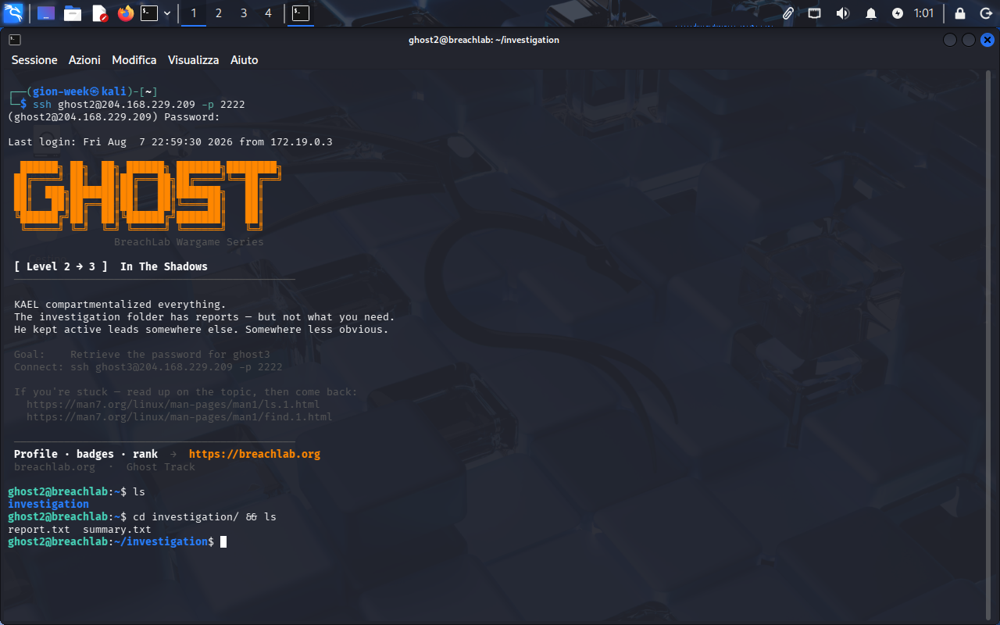
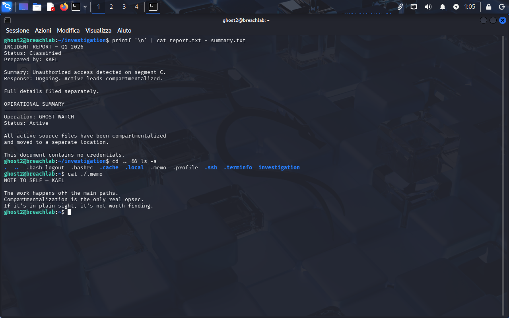
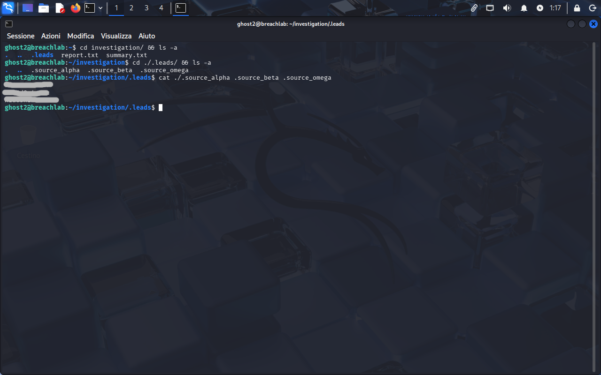

<!-- portfolio-desc: KAEL's compartmentalized leads, hidden behind ls -a instead of a lock -->

# Ghost Level 2 - In The Shadows

## Objective

> KAEL compartmentalized everything. The investigation folder has reports, but not what you need. The active leads sit somewhere else, somewhere less obvious. The goal: find them and pull the password for `ghost3`.

---

## Access

| Field | Value |
|---|---|
| Method | `ssh` |
| Host | `204.168.229.209:2222` |
| User | `ghost2` |
| Password | `[REDACTED]` (found in Level 1) |

```bash
ssh ghost2@204.168.229.209 -p 2222
```

---

## Tools / concepts

- `ls -a`: shows dotfiles a plain `ls` hides
- `cat file - file2`: reads a file, then stdin, then another file, all in one call
- globbing (`*`): matches a group of files sharing a prefix instead of naming each one

---

## Solution

### Step 1: Check the folder the banner already dismissed

The banner is upfront about it: the `investigation` folder has reports, not the goods. `ls` shows just that one directory, and `cd investigation/ && ls` turns up `report.txt` and `summary.txt`, matching the warning exactly.



### Step 2: Read the reports, then read KAEL admitting where the real stuff is

`printf '\n' | cat report.txt - summary.txt` reads both files back to back in one command (the `-` tells `cat` to read stdin in between, and `printf` just supplies a blank line as a separator). The incident report ends with "full details filed separately," and the operational summary is blunter: "this document contains no credentials." Both files openly say they're not the target.

Stepping back up to the home directory with `cd .. && ls -a` (note the `-a` this time) turns up a `.memo` hiding among the usual shell config dotfiles. `cat ./.memo`:

```
NOTE TO SELF — KAEL

The work happens off the main paths.
Compartmentalization is the only real opsec.
If it's in plain sight, it's not worth finding.
```

That's not flavor text, it's the method: stop trusting plain `ls`, start passing `-a`.



### Step 3: Go back in with -a and follow the hidden trail

`cd investigation/ && ls -a` (plain `ls` had already been run here in Step 1 and showed nothing extra) now reveals a `.leads` directory. Inside it, `ls -a` shows three more hidden files: `.source_alpha`, `.source_beta`, `.source_omega`. Reading them one by one works fine:

```bash
cat ./.source_alpha .source_beta .source_omega
```

Since all three share the `.source_` prefix, a glob does the same job without typing each name out: `cat .source_*` from inside `.leads/` (or `cat investigation/.leads/.source_*` from home) expands to the same three files.



### Step 4: Flag found

The password for `ghost3` is printed in the combined output of the three `.source_*` files, under `~/investigation/.leads/`.

---

## Notes

The nesting is the point: KAEL didn't hide the leads in some unrelated corner of the filesystem, he hid them one `-a` away, inside the very folder that looked like a dead end. His own `.memo` is the walkthrough this time, not just commentary, it names the exact habit (default `ls` isn't the whole picture) needed to solve the level.
